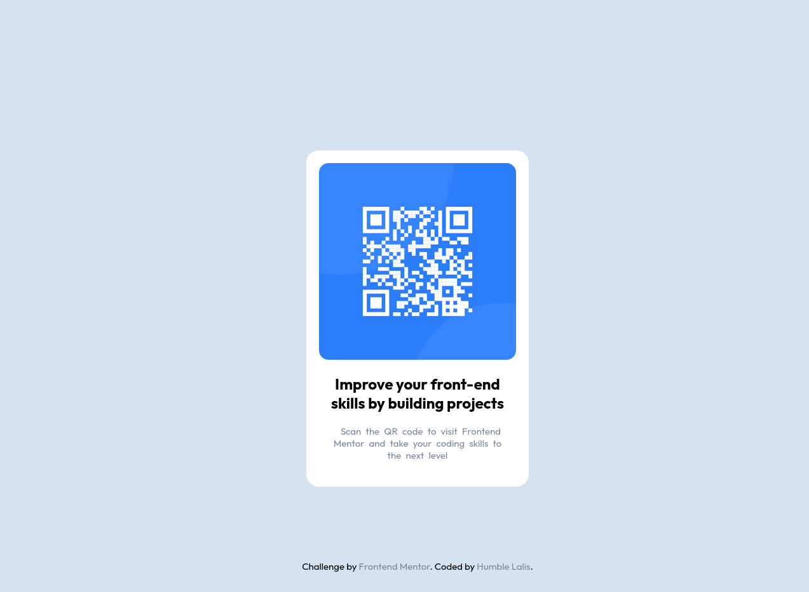

# Frontend Mentor - QR code component solution

This is a solution to the [QR code component challenge on Frontend Mentor](https://www.frontendmentor.io/challenges/qr-code-component-iux_sIO_H). Frontend Mentor challenges help you improve your coding skills by building realistic projects.

## Table of contents

- [Overview](#overview)
  - [Screenshot](#screenshot)
  - [Links](#links)
- [My process](#my-process)
  - [Built with](#built-with)
- [Author](#author)

## Overview

I make a simple responsive design using only CSS and Semantic HTML

### Screenshot

### Links

- Solution URL: [Solution on Git hub](https://github.com/humbl3lalis/qr_code_component_using_HTML_and_CSS.git)
- Live Site URL: [Live site in vercel](https://qr-code-component-using-html-and-css.vercel.app/)

## My process

- Without using any Flexbox or grid properties, I simply space them by using custom variable and center the container using margin top of 25vh

### Built with

- Semantic HTML5 markup
- CSS custom properties
- Mobile-first workflow

## Author

Name : San Linn

- Frontend Mentor - [@humbl3lalis](https://www.frontendmentor.io/profile/humbl3lalis)
